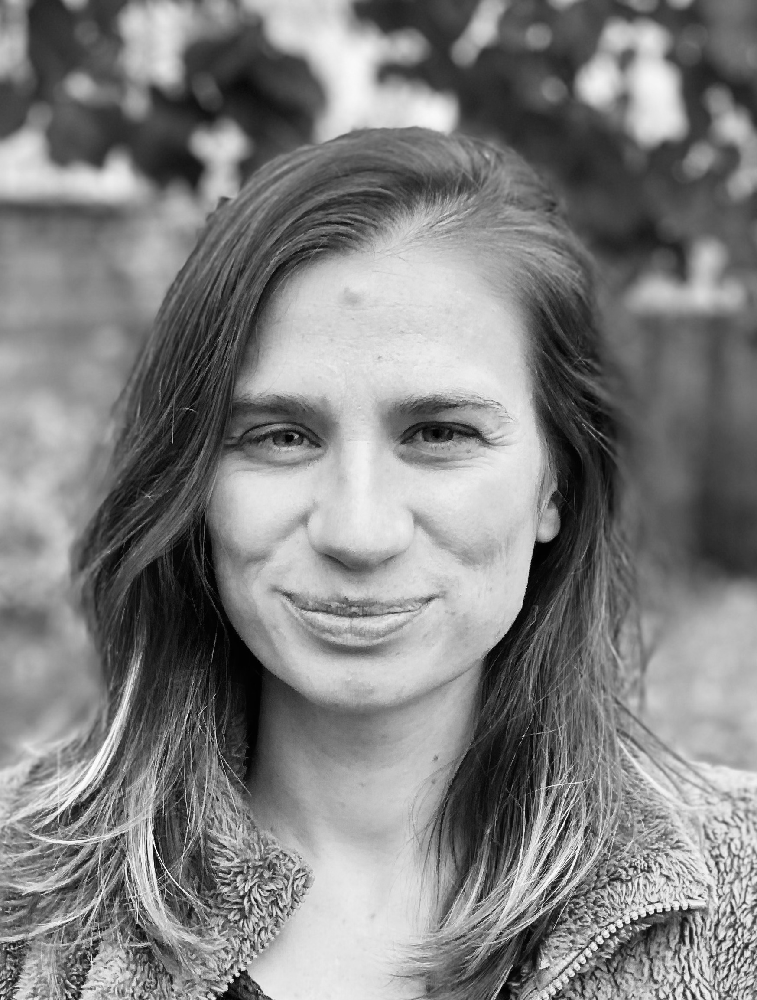

---
# Feel free to add content and custom Front Matter to this file.
# To modify the layout, see https://jekyllrb.com/docs/themes/#overriding-theme-defaults

layout: default
---

# À propos

    

        
 
          Je suis actuellement chargée de recherche CNRS au Laboratoire Jacques Louis Lions <a href="https://www.ljll.math.upmc.fr">(LJLL)</a> de Sorbonne Université, depuis novembre 2022. Je travaille principalement sur la modélisation mathématiques du système respiratoire.  
            
            

    
  

**Contact :** 
Bureau 16-26 324 
4 place Jussieu  
75005 Paris  
            
frederique.noel [at] sorbonne-universite.fr  

## Thèse de doctorat [[Tel]](https://tel.archives-ouvertes.fr/tel-03156080/)
J'ai soutenu une thèse en mathématiques appliquées au laboratoire <a href="https://math.unice.fr">J.A. Dieudonné</a>  à l'université Côte d'Azur en février 2021. Mon travail portait principalement sur la modélisation et l'optimisation de la ventilation pulmonaire dans un poumon sain et enflammé chez les humains mais aussi chez tous les mammifères. Cette thèse a été réalisée sous la direction de <a href="http://benjamin.mauroy.free.fr/wordpress/">Benjamin Mauroy</a>. Lors de cette thèse, j'ai assisté à l'école d'été du <a href="http://smai.emath.fr/cemracs/cemracs18/">CEMRACS 2018</a>, pendant laquelle j'ai travaillé sur le dépôt de particules provenant d'une thérapie par aérosol dans le poumon. Ce travail a été effectué en collaboration avec <a href="https://webusers.imj-prg.fr/~amina.mecherbet/index.html#top">Amina Mecherbet</a> sous la direction de <a href="https://www.ljll.math.upmc.fr/boudin/">Laurent Boudin</a> du LJLL de Sorbonne Université, de <a href="https://team.inria.fr/commedia/grandmont/">Céline Grandmont</a> du LJLL de Sorbonne Université et de l'INRIA de Paris, de <a href="https://helios2.mi.parisdescartes.fr/~bgrec/">Bérénice Grec</a> du laboratoire MAP5 de l'Université de Paris et de <a href="http://smartin.perso.math.cnrs.fr/index.html">Sébastien Martin</a> du laboratoire MAP5 de l'Université de Paris. 

# Recherche

## Thèmes de recherche

- Modélisation mathématique pour le vivant 
- Analyse des EDP 
- Calcul scientifique 

## Publications scientifiques

0. C. Goupil, E. Herbert, C. Karamaoun, B. Mauroy et F. Noël.  
**Economy of organ shapes and function.**  
*Chapter in book: Economic Principles in Cell Biology* (2023). [[PDF]](https://principlescellphysiology.org/book-economic-principles/index.html) 

0. F. Noël et B. Mauroy.  
**Propagation of an idealized infection in an airway tree, consequences of the inflammation on the oxygen transfer to blood.**  
*Journal of Theoretical Biology*, 561(4):111405 (2023). [[PDF]](https://www.sciencedirect.com/science/article/pii/S0022519323000012?via%3Dihub) 

0. F. Noël, C. Karamaoun, J. Dempsey et B. Mauroy.  
**The origin of the allometric scaling of lung ventilation in mammals.**  
*Peer Community Journal, Mathematical and Computational Biology*, Volume 2, article no. e2 (2022). [[PDF]](https://mcb.peercommunityin.org/stream_pdf/t_recommendations.track_change.bc74a3c0bc4e54ab.6d61696e2e706466.pdf) 

0. L. Boudin, C. Grandmont, B. Grec, S. Martin, A. Mecherbet et F. Noël.  
**Fluid-kinetic modelling for respiratory aerosols with variable size and temperature.**  
*ESAIM: Proceedings and Surveys*, 67:100 (2020). [[PDF]](https://www.esaim-proc.org/articles/proc/abs/2020/01/proc206707/proc206707.html) 
 
0. F. Noël et B. Mauroy.  
**Interplay between optimal ventilation and gas transport in a model of the human lung.**  
*Frontiers in Physiology*, 10:488 (2019).[[PDF]](https://www.frontiersin.org/articles/10.3389/fphys.2019.00488/full)
{: reversed="reversed"}

## Exposés scientifiques

- Second Summer School on Economic principles in cell biology, Paris, 10 au 13 juillet 2023. Exposé avec Cyril Karamaoun.
- Séminaire du LJLL, Sorbonne université, Paris, 17 mars 2023.
- Séminaire de l'équipe de modélisation et calcul scientifique du LAGA, Université Sorbonne Paris Nord, Paris, 6 mars 2023.
- Journées Maths Bio Santé, Besançon, 5 au 7 octobre 2022.
- Rencontres Inria-LJLL en calcul scientifique, Sorbonne université, Paris, 3 octobre 2022.
- ERS International Congress, Barcelone, 4 au 6 septembre 2022. Session de poster.
- Séminaire Systèmes complexes en sciences sociales, Ecole des Hautes Etudes en Sciences Sociales (EHESS), Paris, 18 février 2022.
- Séminaire du groupe de travail Modélisation, Analyse et Simulation du MAP5, Université de Paris, Paris, 22 octobre 2021.
- ReaDiNet 2020: An online conference on mathematical biology, en visioconférence, 19 au 23 octobre 2020.
- VentiCorse: Why modeling the pulmonary ventilation ? Music, exercise and medicine, Cargèse, 18 au 22 novembre 2019. Session de poster.
- ReaDiNet 2019: Mathematical Analysis for Biology and Ecology, Nancy, 23 au 25 septembre 2019. Session de poster.
- ReaDiNet 2018: Recent Progress in Mathematical Theories for Biological Phenomena, Jeju, South Korea, 31 octobre au 3 novembre 2018. Session de Poster.
- CEMRACS 2018, CIRM Marseille, Août 2018. Exposé avec Amina Mecherbet.

## Vulgarisation scientifique 

- Rencontres Jeunes Mathématiciennes et Informaticiennes, Paris, 25 octobre 2022. Présentation de mon travail à des lycéennes.
- Festival Sport Santé, Marseille, 21 au 22 juin 2019. Exposition d'un poster. 
